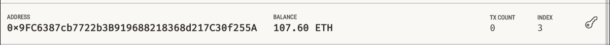

# Cryptocurrency-Wallet

## Description
In this project I am tasked with integrating the Ethereum blockchain network into a web application in order to enable customers to instantly pay fintech professionals in Ether.

In this web application prototype, we have 4 Fintech professionals with their Ethereum account addresses, fintech finder ratings and their hourly rate per Ether listed on the main page. The web app sidebar displays the client account address and balance, a person and number of hours selector boxes and summary calculations for the input values selected before the user can send a transaction. A validated transaction hash is then found at the foot of the sidebar to confirm the success of the transaction.

## Libraries, API and Testing

This project utilizes streamlit, dataclasses, typing, web3 libraries, and the Web3 HTTP Provider API. Testing is validated using the personal Ethereum development blockchain, Ganache.

# Web App Demo Screenshot

# Ganache Transaction Validation Screenshots

